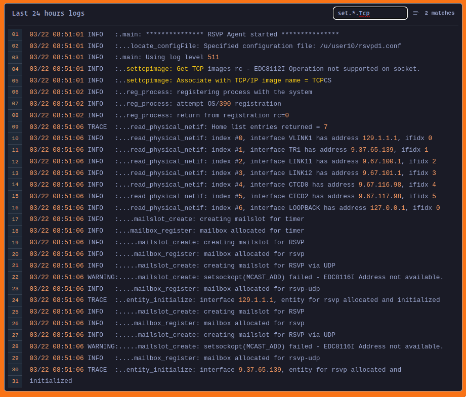

# React HighlightJs Logs



### Demo

[https://react-highlightjs-logs.netlify.app/](https://react-highlightjs-logs.netlify.app/)

### Usage

### installation
Run the following command in your terminal to install the package.

```bash
npm i react-highlightjs-logs
```

### importing
You can import the component as shown below.
```javascript
import { HighlightJsLogs } from "react-highlightjs-logs"
```

### importing styles
You can import the component as shown below.
```javascript
import 'react-highlightjs-logs/dist/styles/index.css'
```


#### with plain data
If you have plain data then you can use the component as shown below.
```javascript
function App() {
  return (
    <div className="p-6">
      <HighlightJsLogs title="Last 24 hours logs" text={`your logs`}/>
    </div>
  );
}
```

#### with url
With url you can use the component as shown below.
```javascript
function App() {
  return (
    <div className="p-6">
      <HighlightJsLogs title="Last 24 hours logs" url="https://example.com"/>
    </div>
  );
}
```

### with websocket
If you wanna use with websocket then use as the shown below.
```javascript
function App() {
  return (
    <div className="p-6">
      <HighlightJsLogs title="Last 24 hours logs" url="wss://example.com" websocket/>
    </div>
  );
}
```

### enablesearch, follow, selectableLines
You can also enable searching, autoscroll to last line, and highlight line on hover by the following properties. 
```javascript
function App() {
  return (
    <div className="p-6">
      <HighlightJsLogs title="Last 24 hours logs" data="Hello World!" follow selectableLines/>
    </div>
  );
}
```

## Technology
- highlight.js for syntax highlighting
- websocket for socket connection
- axios for fetching url data
- react-icons for icons
- tailwindcss for design
- tokyo-night default theme

## Development and Contributing
This repository uses highlight.js, websocket, axios, react-icons and tailwindcss for developing, previewing and building react components. to get started

- Fork and clone this repo
- Install the dependencies with npm or pnpm
- Start development server with npm start. This will launch a preview screen. Open a browser to http://localhost:3000 to preview the React Component.
- Use CTRL-C to exit the preview.
- Use npm run build to generate the compiled component for publishing to npm.

Feel free to open an issue, submit a pull request, or contribute however you would like. Understand that this documentation is still a work in progress, so file and issue or submit a PR to ask questions or make imporvements. Thanks!
